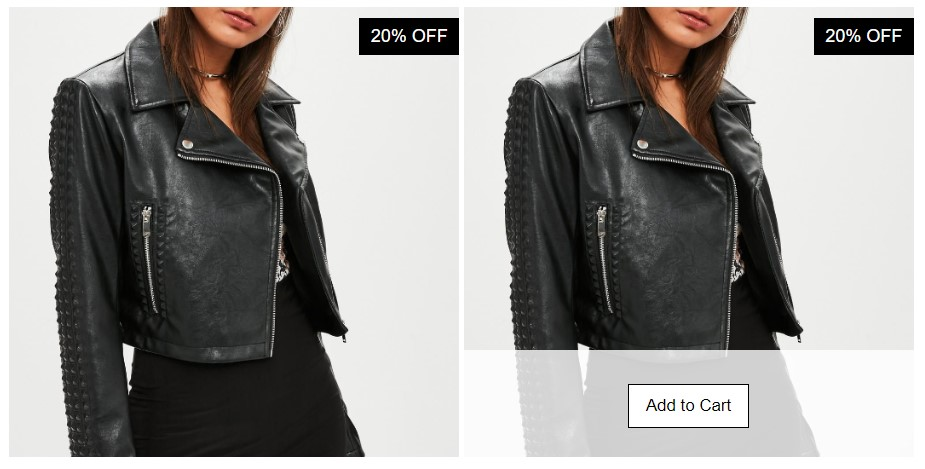
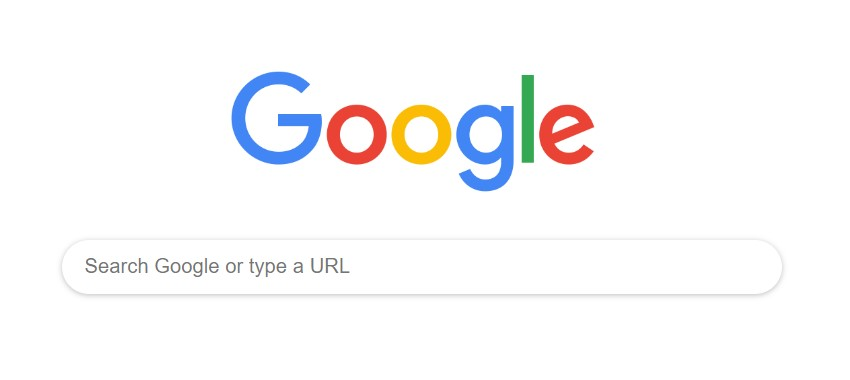
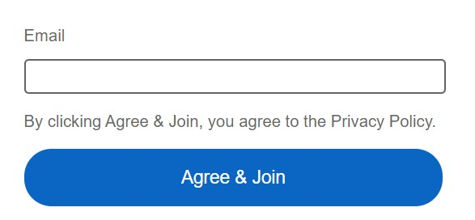

# Project Screenshots

***Project 1: Jacket Sale - Online Store Design***

This section showcases two options for the jacket sale.

***Project 2: Google search***

The recreated Google Search design features a clean and minimalist layout, reminiscent of the familiar Google interface.

***Project 3: LinkedIn Signup Form***

The form provides a streamlined and user-friendly interface for users to create new accounts on the LinkedIn platform.

***Project 4: Twitter: "What's new?" Text Box Design***

Text box design offers a concise and user-friendly interface for users to compose and share tweets on the Twitter platform.

